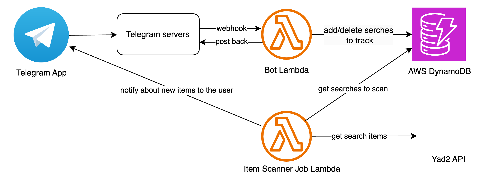

# Yad2Tracker

A telegram bot that track for searches in yad2 website and notify about new items (cars, apartments..)

 

## Demo
The deployed version can be found on telegram as [@yad2trackerbot](t.me/yad2trackerbot)

[Yad2Tracker-Demo.mp4](..%2F..%2F..%2FDownloads%2FYad2Tracker-Demo.mp4)

## Features
* Track and get notified about new items in seraches from Yad2
* In the future - Filter of irrelevant ads such as brokers/traders/asset receivers
* In the future - track changes in the price of ad
* In the future - automatic popup of ads 

## Architecture

Requests come in via the Lambda function URL endpoint, which get routed to a Lambda function.
The bot Lambda function runs and posts back to Telegram and use DynamoDB to manage the user's searches data.
The item scanner job Lambda run in intervals and fetch the updated data about every search in the db to check if there
are new items, if there are - send telegram message to the user track the search.
Layers are defined to avoid duplications of services used by more than one Lambda function. 
Logs are stored on AWS CloudWatch.

All this AWS resources (Lambda functions, Layers, DB) defined using AWS SAM - a toolkit that simplifies building, 
deploying and running serverless applications on AWS and defined in the `template.yaml` file in this project.

## Deployment

### Deploying with AWS

#### Requirements
* [AWS CLI](https://docs.aws.amazon.com/cli/latest/userguide/getting-started-install.html)
* [SAM CLI](https://docs.aws.amazon.com/serverless-application-model/latest/developerguide/install-sam-cli.html)

1. Git clone this repository

`git clone https://github.com/sagirub/Yad2NotificationBot.git ` ` cd Yad2NotificationBot`

2. Create a new bot via [@BotFather](https://telegram.me/BotFather) and note the token
3. To build and deploy your application for the first time, run the following in your shell:

  `sam build --use-container ` ` sam deploy --guided`
