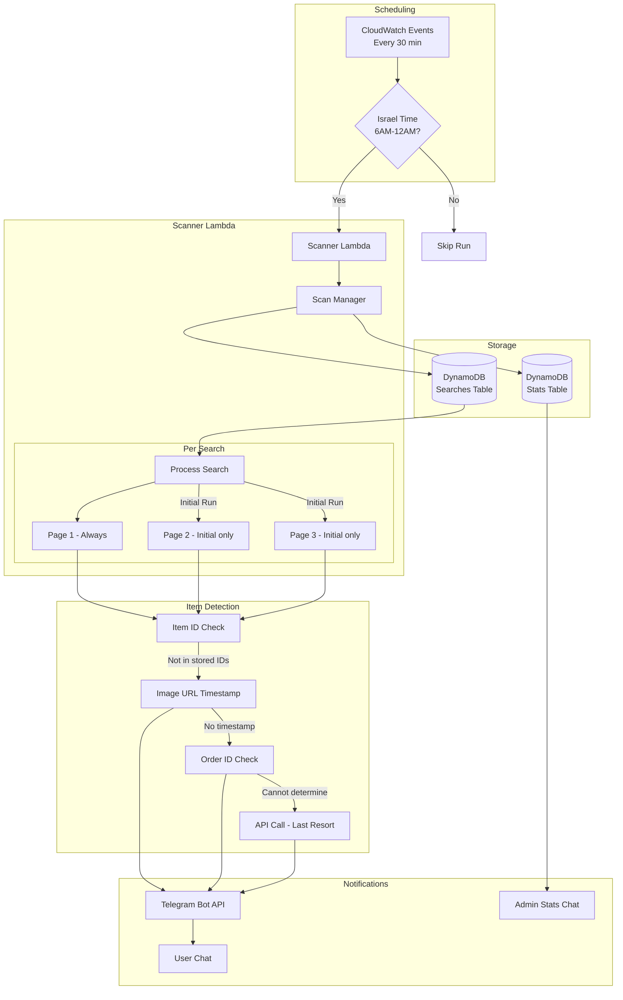
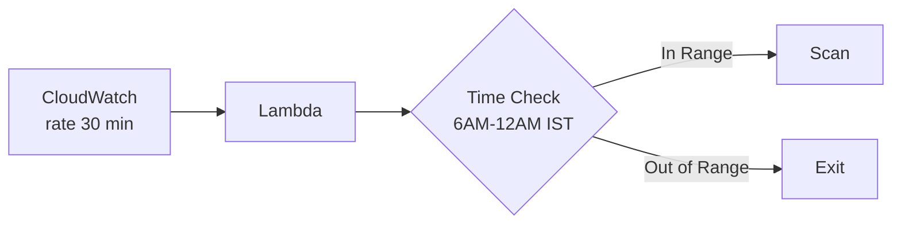
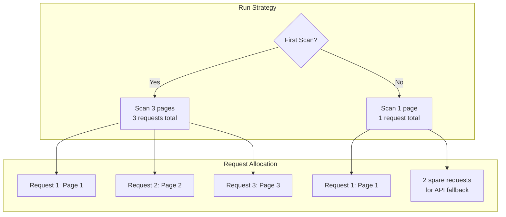
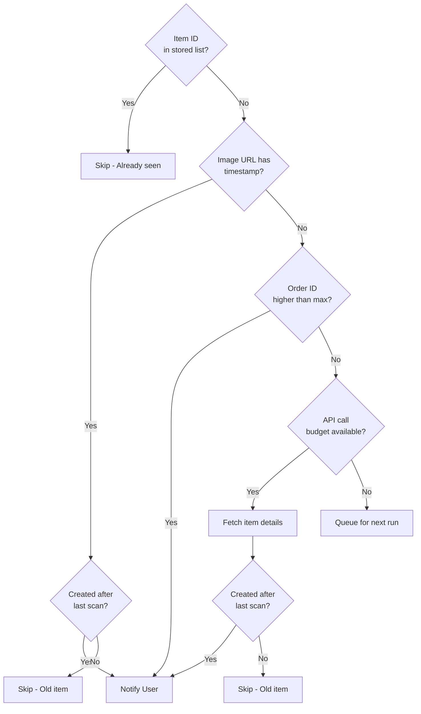

# Yad2 Scanner Architecture v2

## Overview

This document describes the new scanner architecture designed to work within Yad2's rate limiting constraints (blocks after ~3 requests) while providing reliable new item detection and observability.

## Key Requirements

1. **Rate Limiting**: Maximum 3 requests per scanner run
2. **Scheduling**: Run every 30 minutes between 6 AM - 12 AM Israel time
3. **Item Detection Strategy**: Multi-tier approach to detect new items
4. **Observability**: Stats reporting via dedicated Telegram admin chat
5. **Storage**: Maximum 200 item IDs per search
6. **Stats Retention**: 7 days of historical data

---

## Architecture Diagram



---

## Component Design

### 1. Scheduler Strategy

**Option A: Single Lambda with Time Check (Recommended)**



- CloudWatch triggers every 30 minutes (24/7)
- Lambda checks Israel timezone and exits early if outside 6 AM - 12 AM
- Simple, no complex scheduling logic

**Configuration:**
```yaml
# serverless.yml
functions:
  scanner:
    handler: src/scanner/lambda_handler.handler
    timeout: 300
    memorySize: 512
    events:
      - schedule:
          rate: rate(30 minutes)
          enabled: true
    environment:
      SCAN_START_HOUR: 6
      SCAN_END_HOUR: 24  # 12 AM = 24:00
      TIMEZONE: Asia/Jerusalem
```

### 2. Scanner Rate Limiting Strategy

**Per-Run Request Budget: 3 requests**



**Key Design Decisions:**
- **Initial Run**: Scan 3 pages to build comprehensive item ID cache
- **Regular Run**: Scan only page 1 (newest items appear first)
- **Spare Requests**: On regular runs, 2 requests can be used for API fallback if needed

### 3. Item Detection Strategy (Priority Order)



**Detection Methods:**

| Priority | Method | API Calls | Reliability | Notes |
|----------|--------|-----------|-------------|-------|
| 1 | Image URL Timestamp | 0 | High | Extract from `_YYYYMMDDHHMMSS.` pattern |
| 2 | API Item Details | 1 | Highest | Fallback when image URL has no timestamp |

**Note**: Order ID comparison was considered but requires validation. We will NOT use it until we can confirm that higher order_id always means newer item. For now, we rely only on image URL timestamp and API fallback.

### 4. DynamoDB Schema Updates

**Searches Table (existing, with updates):**

```
user_id (HASH) | search_id (RANGE) | name | link | created_at | last_scanned_at | last_item_ids | is_initial_scan_complete
```

New fields:
- `is_initial_scan_complete`: Boolean to track if 3-page initial scan is done

**Stats Table (new):**

```
stat_date (HASH) | stat_hour (RANGE) | searches_scanned | items_found | notifications_sent | requests_success | requests_failed | requests_blocked | detection_by_image | detection_by_api
```

**TTL**: 7 days (automatically delete old stats)

### 5. Observability System

**Stats Collection:**

```mermaid
flowchart LR
    subgraph Per Run
        SCAN[Scanner Run]
        COLLECT[Collect Stats]
        STORE[Store in DynamoDB]
    end
    
    subgraph Reporting
        HOURLY[Hourly Summary]
        DAILY[Daily Summary]
        ALERT[Alert on Issues]
    end
    
    subgraph Delivery
        TG_ADMIN[Telegram Admin Chat]
        TG_CMD[/stats command]
    end
    
    SCAN --> COLLECT --> STORE
    STORE --> HOURLY --> TG_ADMIN
    STORE --> DAILY --> TG_ADMIN
    STORE --> ALERT --> TG_ADMIN
    TG_CMD --> STORE
```

**Stats Metrics:**

| Metric | Description |
|--------|-------------|
| `searches_scanned` | Number of searches processed |
| `items_found` | New items detected |
| `notifications_sent` | Successful notifications |
| `requests_success` | Successful Yad2 requests |
| `requests_failed` | Failed requests (timeout, error) |
| `requests_blocked` | Blocked by captcha/bot protection |
| `detection_by_image` | Items detected via image URL |
| `detection_by_api` | Items detected via API call |

**Telegram Stats Commands:**

```
/stats - Current day summary
/stats today - Today's detailed stats
/stats week - Last 7 days summary
/stats alerts - Show any issues
```

**Run Summary (sent after every run):**

Every scanner run will send a summary message to the admin chat:
```
🔍 Scanner Run Complete
━━━━━━━━━━━━━━━━━━━━━
📊 Searches: 5 scanned
🆕 New Items: 3 found
📨 Notifications: 2 sent
✅ Requests: 4 success / 1 failed
⏱️ Duration: 45s
```

**Automatic Alerts (sent to admin chat):**

- Block rate > 50% in last hour
- No successful scans in last 2 hours
- Error rate > 20%

### 6. Configuration

```python
# src/config.py
class ScannerSettings:
    # Rate limiting
    MAX_REQUESTS_PER_RUN: int = 3
    MAX_PAGES_INITIAL: int = 3
    MAX_PAGES_REGULAR: int = 1
    
    # Scheduling
    SCAN_START_HOUR: int = 6  # 6 AM Israel
    SCAN_END_HOUR: int = 24   # 12 AM Israel (midnight)
    TIMEZONE: str = "Asia/Jerusalem"
    
    # Storage
    MAX_STORED_IDS: int = 200
    STATS_RETENTION_DAYS: int = 7
    
    # Observability
    ADMIN_CHAT_ID: str = ""  # Set via env var - DIFFERENT from user chat
    SEND_RUN_SUMMARY: bool = True  # Send summary after every run
    ALERT_BLOCK_RATE_THRESHOLD: float = 0.5
    ALERT_ERROR_RATE_THRESHOLD: float = 0.2
```

---

## Implementation Plan

### Phase 1: Core Scanner Refactoring
1. Update `ItemScanner` class with new rate limiting logic
2. Implement initial vs regular scan detection
3. Add Order ID tracking and comparison
4. Update DynamoDB schema with new fields

### Phase 2: Scheduling
1. Add timezone-aware scheduling check
2. Configure CloudWatch event rule
3. Test scheduling behavior

### Phase 3: Observability
1. Create Stats table in DynamoDB
2. Implement stats collection in scanner
3. Add `/stats` command to bot
4. Implement automatic alerts

### Phase 4: Testing & Deployment
1. Unit tests for detection strategies
2. Integration tests with mock Yad2 responses
3. Deploy to staging
4. Monitor and tune

---

## File Structure

```
src/
├── scanner/
│   ├── __init__.py
│   ├── lambda_handler.py    # Lambda entry point
│   ├── scanner.py           # Main scanner logic
│   ├── detector.py          # Item detection strategies
│   ├── notifier.py          # Telegram notifications
│   └── stats.py             # Stats collection & reporting
├── bot/
│   ├── handlers/
│   │   └── stats.py         # /stats command handler
│   └── ...
└── config.py                # Configuration with scanner settings
```

---

## Decisions Made

1. **Admin Chat**: Stats sent to a dedicated admin chat ID (separate from user bot usage)

2. **Run Summary**: Every run sends a summary to admin chat for full visibility

3. **Historical Stats**: 7 days retention with DynamoDB TTL

4. **Order ID Strategy**: NOT USED - requires validation first. Only image URL timestamp and API fallback are used.

5. **API Fallback**: YES - when image URL has no timestamp, use API call to get creation time

6. **Alert Frequency**: Send alerts every time a problem occurs (no rate limiting on alerts)

---

## Implementation Checklist

- [ ] Update `src/scanner/scanner.py` with new rate limiting logic
- [ ] Add `is_initial_scan_complete` field to DynamoDB schema
- [ ] Create Stats table in DynamoDB with TTL
- [ ] Implement stats collection in scanner
- [ ] Add run summary notification to admin chat
- [ ] Add `/stats` command to bot
- [ ] Update `serverless.yml` with scanner schedule
- [ ] Add `ADMIN_CHAT_ID` environment variable
- [ ] Test timezone-aware scheduling
- [ ] Deploy and monitor